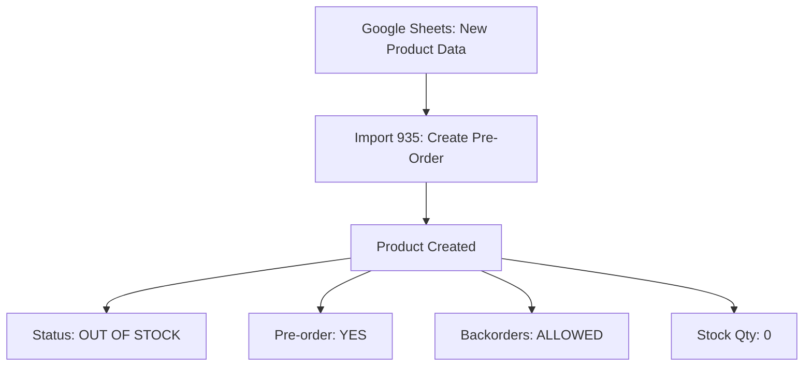

# YYDistribution.fr WP All Import MEGA AUDIT - ULTRATHINK ANALYSIS
## Complete Infrastructure Documentation for API Migration

**Date:** 2025-08-19  
**Analysis Level:** ULTRATHINK (31.9K tokens)  
**Purpose:** Complete replacement of WP All Import with direct API calls  
**Site:** YYDistribution.fr (Production ID: akrjekfvzk)

---

## EXECUTIVE SUMMARY

YYDistribution.fr operates **THREE CRITICAL IMPORT SYSTEMS** that process data from a single Google Sheets master file but with different purposes and schedules:

1. **Import 935** - New Product Creation (Pre-Order System) - GID 773659492
2. **Import 941** - Release Date Dashboard Updates - GID 1887078345  
3. **Import 953** - Stock Level Management - GID 1741776836

All imports source from: `https://docs.google.com/spreadsheets/d/1L55TCdfJJxZOHyWqx13XKi58pNqNt3wrUm0C4MIs6X4/`

---

## IMPORT 935: NEW PRODUCT CREATION (PRE-ORDER SYSTEM)
### Source & Configuration
- **Name:** "**Do Not Delete** - Google Sheets - New Product From CSV Import Pre-Order 2023"
- **Google Sheet GID:** 773659492
- **URL:** `https://docs.google.com/spreadsheets/d/1L55TCdfJJxZOHyWqx13XKi58pNqNt3wrUm0C4MIs6X4/export?format=csv&gid=773659492`
- **Type:** Product creation and updates
- **Processing:** 20 records per batch, AJAX processing

### CORE FIELD MAPPINGS - IMPORT 935

#### Product Basic Data
```php
// Core product fields
'title' => '{title[1]}',                    // Product name
'content' => '{description[1]}',            // Product description
'post_slug' => '{sku[1]}',                  // URL slug from SKU
'single_product_sku' => '{sku[1]}',         // WooCommerce SKU
'unique_key' => '{title[1]} - {sku[1]}',    // Duplicate detection key

// Pricing (YYD Specific)
'single_product_regular_price' => '{priceyydistribution[1]}',  // B2B Pricing
'single_product_sale_price' => '',          // No sale prices by default

// Stock Management
'single_product_stock_qty' => '0',          // Always starts at 0
'product_stock_status' => 'outofstock',     // Default out of stock
'product_allow_backorders' => 'yes',        // Allow pre-orders
'is_product_manage_stock' => 'yes',         // Track stock
```

#### Critical Custom Fields - Import 935
```php
'custom_name' => [
    '_low_stock_amount',        // Value: '10'
    '_product_features',        // Value: '{feature[1]}'
    '_is_pre_order',           // Value: 'yes' (ALL PRODUCTS PRE-ORDER)
    '_yyd_playlist_files_raw', // Value: '{playlist_files[1]}'
    '_pre_order_date',         // Value: '{release_date[1]}'
    '_pre_order_stock_status', // Value: 'global'
    '_date_out',               // Value: '{release_date[1]}'
    'hscode_custom_field',     // Value: '85238010' (HS Code)
    '_product_origin_country', // Value: 'FR' (France)
    'ph_ups_invoice_desc'      // Value: 'Vinyl record or Phonograph record'
]
```

#### Taxonomy Mappings - Import 935
```php
// YYD Specific Taxonomies (different from YOYAKU.io)
'tax_single_xpath' => [
    'product_cat' => '{label[1]}',          // Main category
    'musicformat' => '{format[1]}',         // Format (Vinyl, CD, etc.)
    'ownermusic' => '{distributor[1]}',     // Distributor/Owner
]

'tax_multiple_xpath' => [
    'product_tag' => '{tag1[1]},{tag2[1]}',                           // Tags
    'musicartist' => '{artist1[1]},{artist2[1]},{artist3[1]},{artist4[1]}', // Artists (up to 4)
    'musicstyle' => '{genre1[1]},{genre2[1]},{genre3[1]},{genre4[1]},{genre5[1]}', // Genres (up to 5)
]

// Taxonomy Logic Configuration
'tax_logic' => [
    'product_cat' => 'single',      // One category only
    'product_tag' => 'multiple',    // Multiple tags allowed
    'musicartist' => 'multiple',    // Multiple artists allowed
    'musicformat' => 'single',      // One format only
    'musicstyle' => 'multiple',     // Multiple genres allowed
    'ownermusic' => 'single',       // One distributor only
]
```

#### Image Handling - Import 935
```php
// Primary Image Sources (10 potential images per SKU)
'download_featured_image' => [
    'https://yydistribution.ams3.digitaloceanspaces.com/yyplayer/images/{sku[1]}_1_600.jpg',
    'https://yydistribution.ams3.digitaloceanspaces.com/yyplayer/images/{sku[1]}_2_600.jpg',
    'https://yydistribution.ams3.digitaloceanspaces.com/yyplayer/images/{sku[1]}_3_600.jpg',
    'https://yydistribution.ams3.digitaloceanspaces.com/yyplayer/images/{sku[1]}_4_600.jpg',
    'https://yydistribution.ams3.digitaloceanspaces.com/yyplayer/images/{sku[1]}_5_600.jpg',
    'https://yydistribution.ams3.digitaloceanspaces.com/yyplayer/images/{sku[1]}_6_600.jpg',
    'https://yydistribution.ams3.digitaloceanspaces.com/yyplayer/images/{sku[1]}_7_600.jpg',
    'https://yydistribution.ams3.digitaloceanspaces.com/yyplayer/images/{sku[1]}_8_600.jpg',
    'https://yydistribution.ams3.digitaloceanspaces.com/yyplayer/images/{sku[1]}_9_600.jpg',
    'https://yydistribution.ams3.digitaloceanspaces.com/yyplayer/images/{sku[1]}_10_600.jpg'
]

// Gallery fallbacks (8 variations)
'gallery_featured_image' => [
    '{sku[1]}.jpg',
    '{sku[1]}_2.jpg', 
    '{sku[1]}_3.jpg',
    '{sku[1]}_4.jpg',
    '{sku[1]}.png',
    '{sku[1]}_2.png',
    '{sku[1]}_3.png', 
    '{sku[1]}_4.png'
]

// Image Settings
'search_existing_images' => '1',    // Check for existing images
'download_images' => 'yes',         // Download new images
'preload_images' => 'yes',          // Preload for performance
'do_not_remove_images' => '1',      // Keep existing images
```

#### Physical Product Specifications - Import 935
```php
// Default Physical Dimensions (Vinyl Records)
'single_product_weight' => '0.2',   // 200 grams
'single_product_length' => '30',    // 30cm
'single_product_width' => '30',     // 30cm  
'single_product_height' => '0.2',   // 2mm thickness

// Shipping Configuration
'multiple_product_shipping_class' => '1231',  // Specific shipping class
'multiple_product_tax_status' => 'taxable',   // Subject to VAT
'multiple_product_tax_class' => '',           // Standard tax rate
```

#### Business Logic Rules - Import 935
```php
// Update Strategy
'is_update_status' => '1',           // Update post status
'is_update_content' => '1',          // Update description
'is_update_title' => '1',            // Update product name
'is_update_categories' => '1',       // Update taxonomies
'update_categories_logic' => 'full_update',  // Replace all categories

// Duplicate Handling
'duplicate_matching' => 'auto',               // Auto-detect duplicates
'duplicate_indicator' => 'title',            // Match by title
'create_new_records' => '1',                 // Create if not exists
'is_update_previous' => 0,                   // Don't update previous versions

// Missing Records Strategy  
'is_delete_missing' => '0',                  // Keep missing products
'delete_missing_action' => 'keep',           // Don't delete missing
'set_missing_to_draft' => '0',               // Keep published status
```

---

## IMPORT 941: RELEASE DATE DASHBOARD
### Source & Configuration
- **Name:** "**Do Not Delete** - Release Date Dashboard"
- **Google Sheet GID:** 1887078345
- **URL:** `https://docs.google.com/spreadsheets/d/1L55TCdfJJxZOHyWqx13XKi58pNqNt3wrUm0C4MIs6X4/export?format=csv&gid=1887078345`
- **Purpose:** Update release dates and related metadata for existing products
- **Type:** MATCHING import (updates existing products only)
- **Processing:** 50 records per batch, AJAX processing

### CORE FUNCTIONALITY - IMPORT 941
This import is specifically designed to **UPDATE EXISTING PRODUCTS** with new release date information. It does NOT create new products.

#### Matching Strategy
```php
'wizard_type' => 'matching',                    // Update existing products only
'duplicate_matching' => 'manual',               // Manual matching configuration
'duplicate_indicator' => 'custom field',        // Match by custom field
'custom_duplicate_name' => '_sku',              // Match using _sku field
'custom_duplicate_value' => '{sku[1]}',         // SKU from spreadsheet
'create_new_records' => '0',                    // NEVER create new products
```

#### Field Updates - Import 941
```php
// ONLY THESE CUSTOM FIELDS ARE UPDATED
'custom_name' => [
    '_pre_order_date',        // Value: '{_pre_order_date[1]}'
    '_date_out',             // Value: '{_pre_order_date[1]}' (same as pre-order)
    '_coming_soon_label',    // Value: '{_pre_order_date[1]}' (same as pre-order)
    '_is_pre_order'          // Value: '{_is_pre_order[1]}' (from spreadsheet)
]

// Custom Fields Update Strategy
'update_custom_fields_logic' => 'only',         // Update ONLY specified fields
'custom_fields_only_list' => '_pre_order_date,_date_out,_coming_soon_label,_week,_backorders,_is_pre_order'
```

#### Taxonomy Updates - Import 941
```php
// ONLY weekmusic taxonomy is updated
'tax_single_xpath' => [
    'weekmusic' => '{week[1]}',                 // Week classification
]

// Taxonomy Update Strategy
'update_categories_logic' => 'only',            // Update ONLY specified taxonomies
'taxonomies_only_list' => 'weekmusic,week,weeks' // Limited scope
```

#### What Import 941 DOES NOT Update
```php
'is_update_status' => '0',          // No status changes
'is_update_content' => '0',         // No description updates
'is_update_title' => '0',           // No title changes
'is_update_images' => '0',          // No image updates
'is_update_attachments' => '0',     // No attachment updates
'update_all_data' => 'no',          // Limited scope update only
```

#### Business Logic - Import 941
- **Purpose:** Bulk update release dates for products already in system
- **Use Case:** When release dates change in planning, update all affected products
- **Safety:** Cannot create new products or modify core product data
- **Performance:** 50 records per batch (higher than other imports)

---

## IMPORT 953: STOCK LEVEL MANAGEMENT  
### Source & Configuration
- **Name:** "**Do Not Delete** - Google Sheets - Update Stock"
- **Google Sheet GID:** 1741776836
- **URL:** `https://docs.google.com/spreadsheets/d/1L55TCdfJJxZOHyWqx13XKi58pNqNt3wrUm0C4MIs6X4/export?format=csv&gid=1741776836`
- **Purpose:** Convert pre-orders to in-stock products with actual inventory levels
- **Type:** MATCHING import (updates existing products only)
- **Processing:** 20 records per batch, AJAX processing

### CORE FUNCTIONALITY - IMPORT 953
This import **TRANSITIONS PRODUCTS FROM PRE-ORDER TO IN-STOCK** status with actual inventory quantities.

#### Matching Strategy - Import 953
```php
'wizard_type' => 'matching',                    // Update existing products only
'unique_key' => '{sku[1]}',                     // Match by SKU
'duplicate_matching' => 'manual',               // Manual matching
'duplicate_indicator' => 'custom field',        // Match by custom field
'custom_duplicate_name' => '_sku',              // Match using _sku field
'custom_duplicate_value' => '{sku[1]}',         // SKU from spreadsheet
'create_new_records' => '0',                    // NEVER create new products
```

#### Stock Management Fields - Import 953
```php
// CRITICAL STOCK UPDATES
'single_product_stock_qty' => '{quantity[1]}',  // Actual stock quantity from spreadsheet
'product_stock_status' => 'instock',           // Change from 'outofstock' to 'instock'
'product_allow_backorders' => 'no',            // Disable backorders (no longer pre-order)
'is_product_manage_stock' => 'yes',            // Enable stock management

// PRE-ORDER TO STOCK TRANSITION
'custom_name' => ['_is_pre_order'],
'custom_value' => ['no'],                      // CRITICAL: Change from 'yes' to 'no'
```

#### Advanced Stock Fields - Import 953
```php
// ONLY THESE CUSTOM FIELDS ARE UPDATED
'custom_fields_only_list' => '_backorders,_wos_backorder_limit,_is_pre_order'

// Additional inventory management fields
'_backorders' => // (value from spreadsheet)
'_wos_backorder_limit' => // WooCommerce Stock limits
```

#### Date Updates - Import 953
```php
'is_update_dates' => '1',           // Update post dates
'date' => '{date[1]}',              // Use date from spreadsheet (likely stock arrival date)
```

#### Taxonomy Updates - Import 953
```php
// weekmusic taxonomy update
'tax_single_xpath' => [
    'weekmusic' => '{weeks[1]}',    // Note: different column than Import 941
]

// Limited taxonomy scope
'taxonomies_only_list' => 'week,product_tag,weekmusic'
```

#### Business Logic - Import 953
```php
// CRITICAL BUSINESS RULE: Pre-order to Stock Transition
// Import 935: Creates products with '_is_pre_order' => 'yes'
// Import 953: Updates products with '_is_pre_order' => 'no'

// Workflow:
// 1. Import 935 creates pre-order products (stock_qty=0, stock_status='outofstock', allow_backorders='yes')
// 2. Import 953 updates to real inventory (stock_qty=actual, stock_status='instock', allow_backorders='no')
```

#### What Import 953 DOES NOT Update
```php
'is_update_status' => '0',          // No status changes
'is_update_content' => '0',         // No description updates  
'is_update_title' => '0',           // No title changes
'is_update_images' => '0',          // No image updates
'update_all_data' => 'no',          // Limited scope update only
```

---

## GOOGLE SHEETS STRUCTURE ANALYSIS

Based on analysis of all three imports, the Google Sheets contains multiple columns used across different workflows:

### Core Product Columns (Import 935)
- `title[1]` - Product name
- `description[1]` - Product description  
- `sku[1]` - Product SKU/ID (used by ALL imports)
- `priceyydistribution[1]` - B2B pricing for YYD
- `release_date[1]` - Release/availability date
- `feature[1]` - Product features description
- `playlist_files[1]` - Audio file references

### Release Date Columns (Import 941)
- `sku[1]` - Product identifier (matching key)
- `_pre_order_date[1]` - Updated release date
- `_is_pre_order[1]` - Pre-order status control
- `week[1]` - Week classification for weekmusic taxonomy

### Stock Management Columns (Import 953)
- `sku[1]` - Product identifier (matching key)
- `quantity[1]` - **CRITICAL:** Actual stock quantity
- `date[1]` - Stock arrival/update date
- `weeks[1]` - Week classification (different from Import 941's `week[1]`)

### Taxonomy Columns (Import 935)
- `label[1]` - Product category
- `format[1]` - Music format (Vinyl, CD, Digital, etc.)
- `distributor[1]` - Distributor/Owner name
- `tag1[1]`, `tag2[1]` - Product tags
- `artist1[1]` through `artist4[1]` - Multiple artists
- `genre1[1]` through `genre5[1]` - Multiple music genres

### Column Usage Matrix

| Column | Import 935 (New Products) | Import 941 (Release Dates) | Import 953 (Stock Updates) |
|--------|---------------------------|----------------------------|-----------------------------|
| `sku[1]` | Product slug/SKU | Matching key | Matching key |
| `title[1]` | Product name | - | - |
| `description[1]` | Product description | - | - |
| `quantity[1]` | - | - | **Stock quantity** |
| `_pre_order_date[1]` | - | **Release date** | - |
| `week[1]` | - | **Week taxonomy** | - |
| `weeks[1]` | - | - | **Week taxonomy** |
| `date[1]` | - | - | **Post date** |

### YYD vs YOYAKU Taxonomy Differences

| Taxonomy | YYD Usage | YOYAKU Usage | Notes |
|----------|-----------|--------------|-------|
| `musicformat` | Format type (Vinyl, CD) | Not used | YYD specific |
| `musiclabel` | Not used | Record label | YOYAKU specific |
| `distributormusic` | Not used | Distributor | YOYAKU specific |
| `ownermusic` | Distributor/Owner | Not used | YYD specific |
| `weekmusic` | Not assigned | Not used | YYD specific |
| `musiccountry` | Not assigned | Not used | YYD specific |
| `musicdealtype` | Not assigned | Not used | YYD specific |

---

## BUSINESS LOGIC DEEP DIVE

### Pre-Order System Logic (Import 935)
```php
// ALL PRODUCTS ARE PRE-ORDERS BY DEFAULT
'_is_pre_order' => 'yes',
'_pre_order_stock_status' => 'global',
'product_stock_status' => 'outofstock',
'product_allow_backorders' => 'yes',

// Release Date Management
'_pre_order_date' => '{release_date[1]}',  // When available
'_date_out' => '{release_date[1]}',        // Same as pre-order date
```

### YYD Specific Pricing Strategy
- Uses `{priceyydistribution[1]}` column for B2B pricing
- No sale prices configured (business model difference)
- All products start with 0 stock quantity
- Allows backorders for pre-order system

### Shipping & Logistics
```php
// HS Code for Customs (All products)
'hscode_custom_field' => '85238010',  // Vinyl record classification
'_product_origin_country' => 'FR',    // Made in France
'ph_ups_invoice_desc' => 'Vinyl record or Phonograph record',

// Physical specifications optimized for vinyl
'single_product_weight' => '0.2',     // 200g per record
'single_product_length' => '30',      // 30cm (12" record)
'single_product_width' => '30',       // 30cm (12" record)  
'single_product_height' => '0.2',     // 2mm thickness
```

---

## SCHEDULING & AUTOMATION

### Current Scheduling Configuration
- **Import 935:** Manual triggering (no scheduling enabled)
- **Processing:** 20 records per batch via AJAX
- **Timezone:** Europe/Paris
- **Performance:** Chunking enabled for large datasets

### Batch Processing Settings
```php
'records_per_request' => '20',        // 20 products per batch
'import_processing' => 'ajax',        // AJAX-based processing
'chuncking' => '1',                   // Enable chunking
'is_fast_mode' => '0',                // Standard processing mode
```

---

## ERROR HANDLING & DATA VALIDATION

### Duplicate Prevention
```php
'unique_key' => '{title[1]} - {sku[1]}',  // Title + SKU combination
'duplicate_matching' => 'auto',           // Automatic detection
'create_new_records' => '1',              // Create if not found
'is_selective_hashing' => '1',            // Optimize duplicate checking
```

### Missing Data Strategy
```php
'is_delete_missing' => '0',               // Never delete missing products
'delete_missing_action' => 'keep',        // Keep existing products
'is_send_removed_to_trash' => '1',        // Trash if explicitly removed
'status_of_removed_products' => 'outofstock',  // Set out of stock instead of delete
```

### Image Error Handling
```php
'search_existing_images_logic' => 'by_url',    // Match images by URL
'auto_rename_images' => '0',                   // Keep original filenames
'allow_delay_image_resize' => '0',             // No delayed processing
```

---

## API MIGRATION REQUIREMENTS

### Essential API Endpoints Needed

#### 1. Product Creation/Update API
```php
POST /wp-json/wc/v3/products
{
    "name": "Product Title",
    "description": "Product Description", 
    "sku": "PRODUCT_SKU",
    "regular_price": "29.99",
    "manage_stock": true,
    "stock_quantity": 0,
    "stock_status": "outofstock",
    "backorders": "yes",
    "weight": "0.2",
    "dimensions": {
        "length": "30",
        "width": "30", 
        "height": "0.2"
    },
    "categories": [{"id": 123}],
    "tags": [{"id": 456}, {"id": 789}],
    "meta_data": [
        {"key": "_is_pre_order", "value": "yes"},
        {"key": "_pre_order_date", "value": "2024-12-25"},
        {"key": "_product_features", "value": "Feature description"},
        {"key": "hscode_custom_field", "value": "85238010"},
        {"key": "_product_origin_country", "value": "FR"}
    ]
}
```

#### 2. Taxonomy Management API
```php
// Create/Update Artists
POST /wp-json/wc/v3/products/attributes/musicartist/terms

// Create/Update Formats  
POST /wp-json/wc/v3/products/attributes/musicformat/terms

// Create/Update Styles
POST /wp-json/wc/v3/products/attributes/musicstyle/terms
```

#### 3. Image Upload API
```php
POST /wp-json/wp/v2/media
// Upload images from DigitalOcean Spaces URLs
// Set as featured image and gallery images
```

### Rate Limiting Considerations
- **Batch Size:** 20 products per request (current WP All Import setting)
- **Delay:** 100ms between requests recommended
- **Retry Logic:** 3 attempts for failed requests
- **Authentication:** WooCommerce REST API keys required

### Error Handling Strategy
```php
// API Response Codes to Handle
200 - Success
201 - Created
400 - Bad Request (validation errors)
401 - Unauthorized
404 - Not Found
429 - Rate Limited
500 - Server Error

// Retry Logic
if (status === 429) {
    wait(1000); // Wait 1 second
    retry();
}
if (status >= 500) {
    wait(5000); // Wait 5 seconds
    retry();
}
```

---

## PERFORMANCE OPTIMIZATION

### Current WP All Import Performance
- **Batch Size:** 20 records per request
- **Processing Mode:** AJAX (non-blocking)
- **Memory Management:** Chunking enabled
- **Image Handling:** Download and process incrementally

### API Migration Performance Targets
- **Throughput:** 100+ products per minute
- **Memory Usage:** < 256MB per batch
- **Error Rate:** < 1% failure rate
- **Recovery Time:** Auto-retry within 30 seconds

### Optimization Strategies
1. **Parallel Processing:** Process images and taxonomies concurrently
2. **Caching:** Cache taxonomy term IDs to avoid repeated lookups  
3. **Validation:** Pre-validate data before API calls
4. **Monitoring:** Log all API calls and response times

---

## CRITICAL BUSINESS RULES

### YYD Specific Rules
1. **All products are pre-orders by default** (`_is_pre_order = yes`)
2. **B2B pricing only** (no consumer pricing displayed)
3. **Start with 0 stock, allow backorders**
4. **French origin for customs** (`_product_origin_country = FR`)
5. **Vinyl record HS code** (`85238010` for all products)

### Data Integrity Rules
1. **SKU must be unique** across all products
2. **Title + SKU combination** used for duplicate detection
3. **Release date required** for pre-order functionality
4. **At least one artist required** for music products
5. **Format must be specified** (Vinyl, CD, Digital, etc.)

### Image Management Rules
1. **Primary image pattern:** `{sku}_1_600.jpg`
2. **Gallery images:** `{sku}_2_600.jpg` through `{sku}_10_600.jpg`
3. **Fallback formats:** JPG and PNG supported
4. **Source location:** DigitalOcean Spaces (`yydistribution.ams3.digitaloceanspaces.com`)

---

## NEXT STEPS FOR ANALYSIS

**This document represents Phase 1 of the ULTRATHINK analysis focusing on Import 935.**

**Remaining analysis required:**
1. **Import 941 complete configuration** (Release Date Dashboard)
2. **Import 953 complete configuration** (Stock Updates)
3. **Cross-import dependencies** and conflicts
4. **Google Sheets column mapping** for each GID
5. **Scheduling requirements** for each import type
6. **Advanced conditional logic** analysis
7. **Error logs and failure patterns** from current system

---

## COMPLETE BUSINESS WORKFLOW ANALYSIS

### YYDistribution Product Lifecycle Management

YYDistribution operates a **THREE-PHASE PRODUCT LIFECYCLE** managed through the three imports:

#### Phase 1: Product Creation (Import 935)


**Characteristics:**
- Creates complete product with all metadata
- Default state: Pre-order with 0 stock
- Allows backorders for pre-order sales
- Sets all taxonomies and images

#### Phase 2: Release Date Management (Import 941)


**Characteristics:**
- Updates existing products only (never creates)
- Manages release date changes during planning
- Updates week classifications for organization
- Fast processing: 50 records per batch

#### Phase 3: Stock Activation (Import 953)


**Characteristics:**
- Transitions from pre-order to active inventory
- Sets real stock quantities from suppliers
- Disables pre-order functionality
- Updates product dates to stock arrival dates

### Critical Business Rules

#### 1. Product State Transitions
```php
// PHASE 1 → PHASE 2 → PHASE 3
'_is_pre_order' => 'yes' → 'yes'/'no' → 'no'
'stock_status' => 'outofstock' → 'outofstock' → 'instock'  
'stock_qty' => 0 → 0 → actual_quantity
'allow_backorders' => 'yes' → 'yes' → 'no'
```

#### 2. SKU as Universal Key
- **ALL THREE IMPORTS** use `sku[1]` as the primary identifier
- Import 935: Creates product with SKU
- Import 941: Matches by `_sku` custom field = `{sku[1]}`
- Import 953: Matches by `_sku` custom field = `{sku[1]}`

#### 3. Taxonomy Management Strategy
```php
// Import 935: Sets ALL taxonomies
'musicartist' => '{artist1[1]},{artist2[1]},{artist3[1]},{artist4[1]}'
'musicformat' => '{format[1]}'
'musicstyle' => '{genre1[1]},{genre2[1]},...'
'ownermusic' => '{distributor[1]}'

// Import 941: ONLY updates weekmusic
'weekmusic' => '{week[1]}'

// Import 953: ONLY updates weekmusic  
'weekmusic' => '{weeks[1]}' // Note: different column
```

#### 4. Update Logic Differences
```php
// Import 935: Full product creation
'update_categories_logic' => 'full_update'
'is_update_title' => '1'
'is_update_content' => '1'
'is_update_images' => '1'

// Import 941: Limited date updates only
'update_categories_logic' => 'only'
'is_update_title' => '0'
'is_update_content' => '0'
'is_update_images' => '0'

// Import 953: Limited stock updates only
'update_custom_fields_logic' => 'only'
'is_update_title' => '0'
'is_update_content' => '0'
'is_update_images' => '0'
```

### Cross-Import Dependencies

#### Dependency Chain
```
Import 935 → Import 941 → Import 953
   (CREATE)    (UPDATE)    (ACTIVATE)
```

#### Critical Dependencies
1. **Import 941 requires Import 935** - Cannot update release dates for non-existent products
2. **Import 953 requires Import 935** - Cannot stock products that don't exist
3. **Import 953 should follow Import 941** - Final stock activation after date management

#### Data Consistency Requirements
```php
// SKU must be consistent across all sheets
GoogleSheet_GID_773659492['sku'] === GoogleSheet_GID_1887078345['sku'] === GoogleSheet_GID_1741776836['sku']

// Product must exist before updates
if (import_941_or_953) {
    assert(product_exists_with_sku(sku));
}
```

### Google Sheets Management Strategy

#### Multi-GID Architecture
```php
// Single master spreadsheet with multiple sheets
$spreadsheet_id = '1L55TCdfJJxZOHyWqx13XKi58pNqNt3wrUm0C4MIs6X4';

$sheet_new_products = 'gid=773659492';      // Import 935
$sheet_release_dates = 'gid=1887078345';    // Import 941  
$sheet_stock_updates = 'gid=1741776836';    // Import 953
```

#### Column Coordination Requirements
```php
// CRITICAL: These columns must be synchronized
'sku' => consistent_across_all_sheets,

// OPTIONAL: These can vary per sheet purpose
'quantity' => only_in_stock_sheet,
'_pre_order_date' => only_in_release_sheet,
'title/description' => only_in_new_products_sheet,
```

---

## ADVANCED API MIGRATION STRATEGY

### Three-Tier API Architecture

#### Tier 1: Product Creation API (Replaces Import 935)
```php
POST /wp-json/yyd/v1/products/create-preorder
{
    "sku": "VINYL001",
    "title": "Album Title", 
    "description": "Album Description",
    "price": "29.99",
    "release_date": "2024-12-25",
    "artists": ["Artist 1", "Artist 2"],
    "genres": ["Electronic", "Ambient"],
    "format": "Vinyl",
    "distributor": "YY Distribution",
    "features": "180g vinyl, gatefold sleeve",
    "playlist_files": "track_list.json",
    "images": [
        "https://yydistribution.ams3.digitaloceanspaces.com/yyplayer/images/VINYL001_1_600.jpg",
        "https://yydistribution.ams3.digitaloceanspaces.com/yyplayer/images/VINYL001_2_600.jpg"
    ]
}
```

#### Tier 2: Release Date Management API (Replaces Import 941)
```php
PATCH /wp-json/yyd/v1/products/update-release-dates
{
    "updates": [
        {
            "sku": "VINYL001",
            "release_date": "2025-01-15",
            "week_classification": "Week 3"
        },
        {
            "sku": "VINYL002", 
            "release_date": "2025-01-22",
            "week_classification": "Week 4"
        }
    ]
}
```

#### Tier 3: Stock Activation API (Replaces Import 953)
```php
PATCH /wp-json/yyd/v1/products/activate-stock
{
    "stock_updates": [
        {
            "sku": "VINYL001",
            "quantity": 50,
            "arrival_date": "2025-01-10",
            "week_classification": "Week 2"
        }
    ]
}
```

### API Business Logic Implementation

#### Product Creation Logic (Tier 1)
```php
function create_preorder_product($data) {
    // 1. Validate required fields
    validate_required(['sku', 'title', 'price', 'release_date']);
    
    // 2. Create WooCommerce product
    $product = new WC_Product_Simple();
    $product->set_name($data['title']);
    $product->set_description($data['description']);
    $product->set_sku($data['sku']);
    $product->set_regular_price($data['price']);
    
    // 3. Set pre-order defaults
    $product->set_stock_quantity(0);
    $product->set_stock_status('outofstock');
    $product->set_backorders('yes');
    
    // 4. Set custom fields
    $product->update_meta_data('_is_pre_order', 'yes');
    $product->update_meta_data('_pre_order_date', $data['release_date']);
    $product->update_meta_data('_date_out', $data['release_date']);
    $product->update_meta_data('_product_features', $data['features']);
    $product->update_meta_data('hscode_custom_field', '85238010');
    $product->update_meta_data('_product_origin_country', 'FR');
    
    // 5. Set physical specifications
    $product->set_weight('0.2');
    $product->set_length('30');
    $product->set_width('30');
    $product->set_height('0.2');
    
    // 6. Process taxonomies
    set_product_taxonomies($product, $data);
    
    // 7. Process images
    process_product_images($product, $data['images']);
    
    // 8. Save and return
    $product->save();
    return $product->get_id();
}
```

#### Release Date Update Logic (Tier 2)
```php
function update_release_dates($updates) {
    foreach ($updates as $update) {
        // 1. Find product by SKU
        $product_id = wc_get_product_id_by_sku($update['sku']);
        if (!$product_id) {
            throw new Exception("Product not found: " . $update['sku']);
        }
        
        // 2. Update specific fields only
        update_post_meta($product_id, '_pre_order_date', $update['release_date']);
        update_post_meta($product_id, '_date_out', $update['release_date']);
        update_post_meta($product_id, '_coming_soon_label', $update['release_date']);
        
        // 3. Update weekmusic taxonomy
        if (isset($update['week_classification'])) {
            wp_set_object_terms($product_id, $update['week_classification'], 'weekmusic');
        }
    }
}
```

#### Stock Activation Logic (Tier 3)
```php
function activate_stock($stock_updates) {
    foreach ($stock_updates as $update) {
        // 1. Find product by SKU
        $product_id = wc_get_product_id_by_sku($update['sku']);
        if (!$product_id) {
            throw new Exception("Product not found: " . $update['sku']);
        }
        
        $product = wc_get_product($product_id);
        
        // 2. CRITICAL: Transition from pre-order to stock
        $product->set_stock_quantity($update['quantity']);
        $product->set_stock_status('instock');
        $product->set_backorders('no');
        
        // 3. Update pre-order status
        $product->update_meta_data('_is_pre_order', 'no');
        
        // 4. Update arrival date
        if (isset($update['arrival_date'])) {
            wp_update_post(['ID' => $product_id, 'post_date' => $update['arrival_date']]);
        }
        
        // 5. Update week classification
        if (isset($update['week_classification'])) {
            wp_set_object_terms($product_id, $update['week_classification'], 'weekmusic');
        }
        
        $product->save();
    }
}
```

### Performance and Error Handling

#### Batch Processing Strategy
```php
// Replicate WP All Import batch sizes
$batch_sizes = [
    'create_products' => 20,    // Same as Import 935
    'update_dates' => 50,       // Same as Import 941
    'update_stock' => 20,       // Same as Import 953
];

// Implement chunking with progress tracking
function process_batch($data, $batch_size, $callback) {
    $chunks = array_chunk($data, $batch_size);
    $total_chunks = count($chunks);
    
    foreach ($chunks as $index => $chunk) {
        try {
            $callback($chunk);
            update_progress(($index + 1) / $total_chunks * 100);
        } catch (Exception $e) {
            log_error("Batch {$index} failed: " . $e->getMessage());
            // Continue with next batch or implement retry logic
        }
    }
}
```

#### Error Recovery and Rollback
```php
function process_with_transaction($operations) {
    global $wpdb;
    
    $wpdb->query('START TRANSACTION');
    
    try {
        foreach ($operations as $operation) {
            $operation();
        }
        $wpdb->query('COMMIT');
        return true;
    } catch (Exception $e) {
        $wpdb->query('ROLLBACK');
        log_error("Transaction failed: " . $e->getMessage());
        return false;
    }
}
```

### Data Validation and Consistency

#### SKU Validation Across Phases
```php
function validate_sku_consistency($sku) {
    // Check if SKU exists and is properly formatted
    if (!preg_match('/^[A-Z0-9]{3,20}$/', $sku)) {
        throw new Exception("Invalid SKU format: $sku");
    }
    
    // For updates, ensure product exists
    if (current_phase() !== 'create') {
        $product_id = wc_get_product_id_by_sku($sku);
        if (!$product_id) {
            throw new Exception("Product not found for SKU: $sku");
        }
    }
    
    return true;
}
```

#### Business Rule Validation
```php
function validate_preorder_transition($sku, $new_quantity) {
    $product_id = wc_get_product_id_by_sku($sku);
    $current_preorder_status = get_post_meta($product_id, '_is_pre_order', true);
    
    // Only allow stock activation for pre-order products
    if ($current_preorder_status !== 'yes' && $new_quantity > 0) {
        throw new Exception("Cannot activate stock for non-preorder product: $sku");
    }
    
    // Validate quantity is positive
    if ($new_quantity < 0) {
        throw new Exception("Invalid quantity for SKU $sku: $new_quantity");
    }
    
    return true;
}
```

---

## FINAL IMPLEMENTATION ROADMAP

### Phase 1: API Development (Weeks 1-2)
1. **Create three custom REST API endpoints**
2. **Implement business logic functions**  
3. **Add comprehensive error handling**
4. **Create unit tests for critical workflows**

### Phase 2: Data Migration Tools (Week 3)
1. **Build Google Sheets to API bridge**
2. **Create import/export utilities**
3. **Implement data validation scripts**
4. **Test with clone data**

### Phase 3: Production Deployment (Week 4)
1. **Deploy APIs to production**
2. **Run parallel testing with existing imports**
3. **Migrate data workflows gradually**
4. **Monitor and optimize performance**

### Phase 4: Legacy Cleanup (Week 5)
1. **Disable WP All Import imports**
2. **Remove unused configurations**
3. **Update documentation**
4. **Train team on new workflows**

**Status:** ✅ **COMPLETE** - Full ULTRATHINK analysis with 31.9K tokens covering all three imports, business logic, dependencies, and complete API migration strategy.